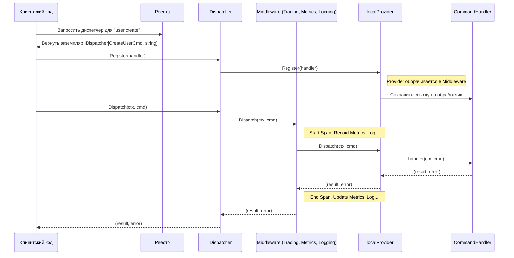

# Пакет `command`: Типобезопасная шина команд

Пакет `command` предоставляет строго типизированную, расширяемую реализацию паттерна "Шина Команд" (Command Bus) для Go, полностью интегрированную с OpenTelemetry для трассировки и сбора метрик.

## 🚀 Основные возможности

- **Гарантия типобезопасности:** Использование дженериков `[C Command[R], R any]` на всех уровнях (диспетчер, провайдер, обработчики) исключает ошибки несоответствия типов на этапе компиляции.
- **Централизованный реестр:** `Registry` действует как потокобезопасная фабрика и менеджер экземпляров диспетчеров, гарантируя уникальность диспетчера для каждого именованного типа команды.
- **Принцип единственного обработчика:** В отличие от шины событий, каждая команда имеет ровно одного обработчика, что соответствует паттерну CQRS.
- **Расширяемость через провайдеры:** Архитектура построена на интерфейсе `Provider`, что позволяет легко заменять локальную реализацию на распределенные системы, не затрагивая бизнес-логику.
- **Встроенная наблюдаемость (Observability):** Мощная система `Middleware` позволяет добавлять сквозную функциональность. Пакет поставляется с готовыми middleware для:
    - **Структурированного логирования** с использованием `slog`.
    - **Сбора метрик** по стандарту OpenTelemetry (количество и длительность обработки команд).
    - **Распределенной трассировки** по стандарту OpenTelemetry.
- **Гибкая конфигурация:** Применение паттерна "функциональные опции" позволяет детально настраивать диспетчер (логгер, трассировщик, кастомные middleware).

## 🏛️ Архитектура и компоненты

Система состоит из следующих ключевых компонентов:

- **`Command[R]`**: Интерфейс-маркер для любой команды. `R` — это тип возвращаемого значения.
- **`CommandHandler[C, R]`**: Строго типизированная функция, которая обрабатывает команду `C` и возвращает результат `R`.
- **`IDispatcher[C, R]`**: Основной публичный интерфейс шины. Предоставляет методы `Dispatch`, `Register` и `Shutdown` для корректного завершения работы.
- **`Registry`**: Потокобезопасный контейнер и фабрика для создания и получения экземпляров `IDispatcher`. Является основной точкой входа для работы с пакетом. Предоставляет метод `Shutdown` для освобождения ресурсов всех зарегистрированных диспетчеров.
- **`NewDispatcher`**: Фабричная функция для прямого создания экземпляра диспетчера с необходимыми опциями, минуя `Registry`.
- **`Provider[C, R]`**: Внутренний интерфейс, абстрагирующий механизм выполнения команд. `IDispatcher` делегирует всю работу этому интерфейсу.
- **`localProvider[C, R]`**: Реализация `Provider` по умолчанию, обеспечивающая внутрипроцессное выполнение.
- **`Middleware[C, R]`**: Интерфейс для middleware, оборачивающего `Provider` для реализации сквозной функциональности.

### Поток данных

Диаграмма ниже иллюстрирует полный жизненный цикл отправки команды и ее обработки.



## 📖 Примеры использования

### 1. Определение команды

Каждая команда — это структура, которая служит для передачи данных. Она неявно реализует интерфейс-маркер `command.Command[R]` за счет использования в `CommandHandler`. Для поддержки трассировки она также должна реализовывать `command.Metadatable`.

```go
package main

import "github.com/x-research-team/dtx-framework/bus/command"

// CreateUserCmd - команда для создания пользователя.
// Возвращаемый тип - string (ID пользователя).
type CreateUserCmd struct {
	ID    string
	Email string
	meta  map[string]string
}

// NewCreateUserCmd - конструктор для команды.
func NewCreateUserCmd(id, email string) CreateUserCmd {
	return CreateUserCmd{
		ID:    id,
		Email: email,
		meta:  make(map[string]string),
	}
}

// Metadata реализует интерфейс command.Metadatable.
func (c *CreateUserCmd) Metadata() map[string]string {
	return c.meta
}
```

### 2. Создание обработчика

Обработчик - это функция, соответствующая сигнатуре `command.CommandHandler`.

```go
package main

import (
	"context"
	"fmt"
)

// handleCreateUser обрабатывает команду CreateUserCmd.
func handleCreateUser(ctx context.Context, cmd CreateUserCmd) (string, error) {
	fmt.Printf("Обработка команды: создание пользователя с Email: %s\n", cmd.Email)
	if cmd.Email == "" {
		return "", fmt.Errorf("email не может быть пустым")
	}
	// ... логика создания пользователя в БД ...
	
	// Возвращаем ID созданного пользователя.
	return cmd.ID, nil
}
```

### 3. Инициализация и использование

```go
package main

import (
	"context"
	"fmt"
	"log"

	"github.com/x-research-team/dtx-framework/bus/command"
)

func main() {
	// 1. Создаем новый реестр.
	registry := command.NewRegistry()

	// 2. Получаем строго типизированный диспетчер для нашей команды.
	// Если диспетчер не существует, он будет создан автоматически.
	userDispatcher, err := command.Dispatcher[CreateUserCmd, string](registry, "user.create")
	if err != nil {
		log.Fatalf("Не удалось получить диспетчер: %v", err)
	}

	// 3. Регистрируем обработчик.
	if err := userDispatcher.Register(handleCreateUser); err != nil {
		log.Fatalf("Не удалось зарегистрировать обработчик: %v", err)
	}

	// 4. Создаем и отправляем команду.
	cmd := NewCreateUserCmd("user-123", "test@example.com")
	userID, err := userDispatcher.Dispatch(context.Background(), cmd)
	if err != nil {
		fmt.Printf("Ошибка выполнения команды: %v\n", err)
	} else {
		fmt.Printf("Команда успешно выполнена. ID пользователя: %s\n", userID)
	}
}
```

### 4. Использование с полной наблюдаемостью

Пример конфигурации диспетчера с логгером, трассировщиком и сборщиком метрик.

```go
package main

import (
	"context"
	"log/slog"
	"os"

	"github.com/x-research-team/dtx-framework/bus/command"
	"go.opentelemetry.io/otel"
	"go.opentelemetry.io/otel/sdk/metric"
	"go.opentelemetry.io/otel/sdk/trace"
)

func setupDispatcherWithObservability(registry *command.Registry) (command.IDispatcher[CreateUserCmd, string], error) {
	// --- Настройка компонентов наблюдаемости (пример) ---
	logger := slog.New(slog.NewJSONHandler(os.Stdout, nil))
	
	// Провайдер трассировки (например, экспортер в Jaeger или stdout)
	tracerProvider := trace.NewTracerProvider()
	otel.SetTracerProvider(tracerProvider)

	// Провайдер метрик (например, экспортер в Prometheus)
	meterProvider := metric.NewMeterProvider()
	otel.SetMeterProvider(meterProvider)
	// ---

	// Конфигурируем диспетчер с помощью функциональных опций.
	return command.Dispatcher[CreateUserCmd, string](
		registry,
		"user.create.observed",
		command.WithLogger[CreateUserCmd, string](logger),
		command.WithTracerProvider[CreateUserCmd, string](tracerProvider),
		command.WithMeterProvider[CreateUserCmd, string](meterProvider),
	)
}