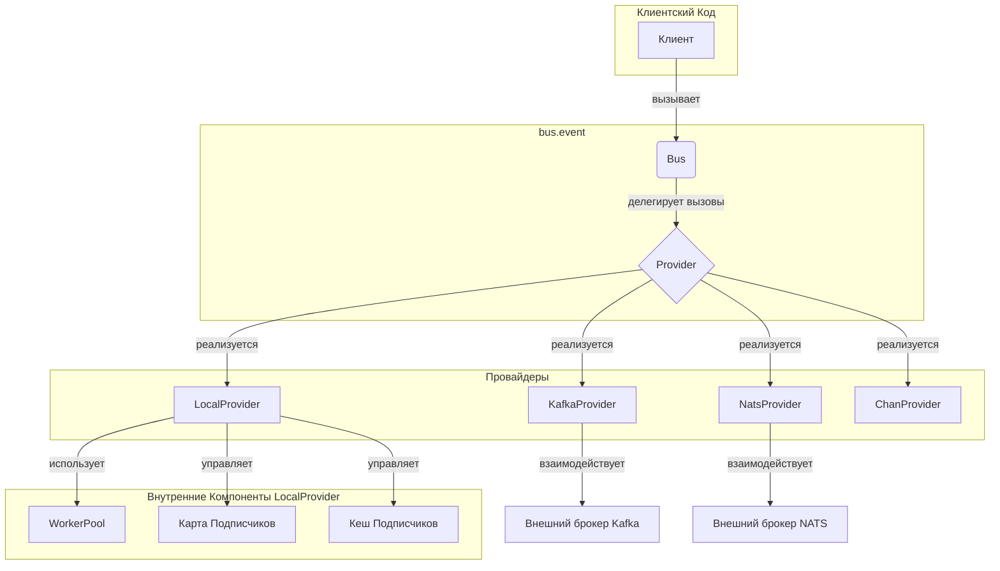

# Event Bus

Высокопроизводительная, потокобезопасная, статически типизированная и расширяемая локальная шина событий для Go.

## Основные возможности

*   **Статическая типизация:** Использование дженериков (Generics) и рефлексии для обеспечения безопасности типов на этапе компиляции и во время выполнения. Вы можете передавать строго типизированные обработчики, например `func(ctx, UserCreatedEvent)`, без необходимости ручного приведения типов.
*   **Расширяемая архитектура провайдеров:** Шина использует интерфейс `Provider`, что позволяет легко заменять реализацию. По умолчанию используется `LocalProvider` для локальной обработки, но вы можете создать и подключить собственного провайдера (например, для Kafka, NATS или любого другого брокера сообщений).
*   **Потокобезопасность:** Гарантированная безопасность при работе в многопоточной среде.
*   **Синхронная и асинхронная обработка:** Поддержка как синхронных, так и асинхронных обработчиков событий с помощью внутреннего пула воркеров.
*   **Промежуточное ПО (Middleware):** Возможность добавления middleware для расширения функциональности обработчиков.
*   **Гибкая конфигурация:** Настройка шины и подписок с помощью паттерна "функциональные опции".
*   **Наблюдаемость:** Встроенные интерфейсы для логирования и сбора метрик.
*   **Надежность:** Механизм корректного завершения работы, гарантирующий обработку всех событий.
*   **Поддержка CQRS:** Идеально подходит для реализации паттерна CQRS в ваших приложениях.

### 📈 Mermaid-диаграмма



## Установка

```bash
go get github.com/X-Research-Team/dtx-framework/bus/event
```

## Пример использования

Ниже приведен полный пример, демонстрирующий основные возможности шины событий, включая использование строго типизированных обработчиков и сменных провайдеров.

```go
package main

import (
	"context"
	"fmt"
	"log"
	"sync"
	"time"

	"github.com/X-Research-Team/dtx-framework/bus/event"
)

// 1. Определение событий

// UserCreatedEvent - событие создания пользователя
type UserCreatedEvent struct {
	UserID string
	Email  string
}

func (e UserCreatedEvent) Topic() string {
	return "user.created"
}

// OrderPlacedEvent - событие размещения заказа
type OrderPlacedEvent struct {
	OrderID string
	Amount  float64
}

func (e OrderPlacedEvent) Topic() string {
	return "order.placed"
}

// 2. Создание и настройка шины

func main() {
	// Создаем новую шину событий с опциями для логирования и метрик.
	// Для использования другого провайдера, передайте его через опцию WithProvider.
	// bus, _ := event.NewBus(event.WithProvider(your_provider.New()))
	bus, err := event.NewBus(
		// Пример подключения стандартного логгера
		event.WithLogger(log.New(log.Writer(), "[EventBus] ", log.LstdFlags)),
		// Пример конфигурации пула воркеров
		event.WithWorkerPoolConfig(2, 10, 256),
	)
	if err != nil {
		log.Fatalf("Не удалось создать шину: %v", err)
	}
	defer bus.Shutdown(context.Background())

	// 3. Создание строго типизированных обработчиков

	// Синхронный обработчик для UserCreatedEvent.
	userCreatedHandler := func(ctx context.Context, ev UserCreatedEvent) error {
		fmt.Printf("[Синхронный обработчик] Пользователь создан: ID=%s, Email=%s\n", ev.UserID, ev.Email)
		return nil
	}

	// Асинхронный обработчик для OrderPlacedEvent.
	orderPlacedHandler := func(ctx context.Context, ev OrderPlacedEvent) error {
		fmt.Printf("[Асинхронный обработчик] Заказ размещен: ID=%s, Сумма=%.2f\n", ev.OrderID, ev.Amount)
		time.Sleep(100 * time.Millisecond) // Имитация долгой работы
		return nil
	}

	// Обработчик ошибок для конкретного типа события.
	orderErrorHandler := func(err error, e OrderPlacedEvent) {
		log.Printf("Ошибка при обработке OrderPlacedEvent %v: %v", e, err)
	}

	// 4. Подписка на события

	// Подписываем синхронный обработчик.
	unsubscribeUser, err := bus.Subscribe(UserCreatedEvent{}.Topic(), userCreatedHandler)
	if err != nil {
		log.Fatalf("Не удалось подписаться на событие 'user.created': %v", err)
	}
	defer unsubscribeUser()

	// Подписываем асинхронный обработчик с обработчиком ошибок.
	unsubscribeOrder, err := bus.Subscribe(
		OrderPlacedEvent{}.Topic(),
		orderPlacedHandler,
		event.WithAsync[OrderPlacedEvent](),
		event.WithErrorHandler[OrderPlacedEvent](orderErrorHandler),
	)
	if err != nil {
		log.Fatalf("Не удалось подписаться на событие 'order.placed': %v", err)
	}
	defer unsubscribeOrder()

	// 5. Публикация событий

	fmt.Println("Публикация событий...")
	var wg sync.WaitGroup
	wg.Add(2)

	go func() {
		defer wg.Done()
		err := bus.Publish(context.Background(), UserCreatedEvent{UserID: "user-123", Email: "test@example.com"})
		if err != nil {
			log.Printf("Ошибка публикации UserCreatedEvent: %v", err)
		}
	}()

	go func() {
		defer wg.Done()
		err := bus.Publish(context.Background(), OrderPlacedEvent{OrderID: "order-456", Amount: 99.99})
		if err != nil {
			log.Printf("Ошибка публикации OrderPlacedEvent: %v", err)
		}
	}()

	wg.Wait()
	fmt.Println("Все события опубликованы.")

	// 6. Корректное завершение работы
	// defer bus.Shutdown() гарантирует, что все асинхронные обработчики завершат свою работу.
	fmt.Println("Завершение работы...")
}
```

## API

### `event.Event`

Основной интерфейс, который должно реализовывать любое событие.

```go
type Event interface {
    Topic() string
}
```

### `event.EventHandler[T]`

Тип для функции-обработчика событий. `T` должен быть конкретным типом, реализующим `event.Event`.

```go
type EventHandler[T Event] func(ctx context.Context, event T) error
```

### `event.EventBus`

Основной интерфейс шины событий. Реализация `*Bus[T]` является обобщенной, но для удобства использования `NewBus` возвращает `*Bus[Event]`, что позволяет работать с любыми событиями.

```go
// Полный интерфейс не приводится для краткости. Ключевые методы:
Publish(ctx context.Context, event Event) error
Subscribe(topic string, handler any, opts ...SubscribeOption[Event]) (unsubscribe func(), err error)
Shutdown(ctx context.Context) error
```

### `event.NewBus(...)`

Функция-конструктор для создания нового экземпляра шины.

```go
func NewBus(opts ...BusOption) *Bus[Event]
```

### `Subscribe`

Метод `Subscribe` принимает `any` в качестве обработчика, но использует рефлексию для обеспечения типобезопасности во время выполнения. Вы можете передавать функции вида `func(ctx, YourEventType) error`, и шина автоматически создаст обертку.

### Опции

Шина и подписки настраиваются с помощью паттерна "функциональные опции", что обеспечивает гибкость и читаемость.

#### Опции для `NewBus` (`BusOption`)

Эти опции передаются в конструктор `NewBus` для настройки глобального поведения шины.

*   `WithProvider(p Provider)`: Позволяет заменить стандартный `LocalProvider` на любую другую реализацию (например, Kafka, NATS). Это ключевая опция для расширения системы.
    ```go
    // Пример: использование собственного провайдера
    // import "your/custom/provider"
    // customProvider := provider.New()
    // bus, _ := event.NewBus(event.WithProvider(customProvider))
    ```
*   `WithLogger(logger Logger)`: Подключает ваш логгер (совместимый с интерфейсом `event.Logger`) для получения отладочной информации от шины.
    ```go
    // Пример: использование стандартного логгера
    // import "log"
    // myLogger := log.New(os.Stdout, "[EventBus] ", log.LstdFlags)
    // bus, _ := event.NewBus(event.WithLogger(myLogger))
    ```
*   `WithMetrics(metrics Metrics)`: Подключает вашу систему метрик (совместимую с `event.Metrics`) для сбора данных о производительности (количество событий, длительность обработки).
    ```go
    // Пример: использование кастомной реализации метрик
    // import "your/metrics/collector"
    // myMetrics := collector.New()
    // bus, _ := event.NewBus(event.WithMetrics(myMetrics))
    ```
*   `WithWorkerPoolConfig(min, max, queueSize int)`: Настраивает параметры внутреннего пула воркеров, который используется `LocalProvider` для асинхронной обработки событий.
    *   `min`: минимальное количество воркеров.
    *   `max`: максимальное количество воркеров.
    *   `queueSize`: размер очереди для задач.

#### Опции для `Subscribe` (`SubscribeOption[T]`)

Эти опции передаются в метод `Subscribe` для настройки поведения конкретной подписки.

*   `WithAsync[T]()`: Указывает, что обработчик для данной подписки должен выполняться асинхронно в отдельной горутине (из пула воркеров). Без этой опции обработчик выполняется синхронно.
*   `WithErrorHandler[T](handler ErrorHandler[T])`: Регистрирует функцию обратного вызова, которая будет вызвана, если обработчик события вернет ошибку.
*   `WithMiddleware[T](mw ...Middleware[T])`: Добавляет одну или несколько функций промежуточного ПО (middleware) к обработчику. Middleware выполняются в порядке их добавления, оборачивая основной обработчик.