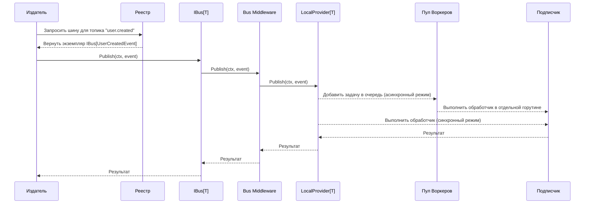

# Пакет `event`: Типобезопасная шина событий

Пакет `event` предоставляет высокопроизводительную, типобезопасную и расширяемую реализацию внутрипроцессной (in-process) шины событий на основе обобщений (generics) Go. Он спроектирован для обеспечения слабой связанности компонентов системы, поддерживая как синхронную, так и асинхронную обработку с первоклассной поддержкой наблюдаемости (логирование, метрики, трассировка).

## 🚀 Основные возможности

- **Гарантия типобезопасности:** Использование дженериков `[T Event]` на всех уровнях (шина, провайдер, обработчики) исключает ошибки несоответствия типов событий на этапе компиляции.
- **Централизованный реестр:** `Registry` действует как потокобезопасная фабрика и менеджер экземпляров шин, гарантируя уникальность шины для каждой пары "топик-тип события".
- **Синхронная и асинхронная обработка:** Подписчики могут обрабатывать события как в блокирующем (синхронном) режиме, так и в неблокирующем (асинхронном) режиме с использованием внутреннего пула воркеров.
- **Расширяемость через провайдеры:** Архитектура построена на интерфейсе `Provider`, что позволяет легко заменять локальную реализацию на распределенные системы (например, Kafka, NATS, RabbitMQ), не затрагивая бизнес-логику.
- **Встроенная наблюдаемость (Observability):** Мощная система `Middleware` позволяет добавлять сквозную функциональность. Пакет поставляется с готовыми middleware для:
    - **Структурированного логирования** с использованием `slog`.
    - **Сбора метрик** по стандарту OpenTelemetry (количество и длительность обработки событий).
    - **Распределенной трассировки** по стандарту OpenTelemetry (создание producer/consumer спанов).
- **Гибкая конфигурация:** Применение паттерна "функциональные опции" позволяет детально настраивать как саму шину (логгер, трассировщик), так и каждую отдельную подписку (режим обработки, обработчик ошибок, middleware).

## 🏛️ Архитектура и компоненты

Система состоит из следующих ключевых компонентов:

- **`IBus[T Event]`**: Основной публичный интерфейс шины. Предоставляет методы `Publish` и `Subscribe`.
- **`Registry`**: Потокобезопасный контейнер и фабрика для создания и получения экземпляров `IBus`. Является основной точкой входа для работы с пакетом.
- **`Provider[T Event]`**: Внутренний интерфейс, абстрагирующий механизм доставки событий. `IBus` делегирует всю работу этому интерфейсу.
- **`LocalProvider[T Event]`**: Реализация `Provider` по умолчанию, обеспечивающая внутрипроцессную доставку сообщений.
- **`BusMiddleware[T Event]`**: Интерфейс для middleware, оборачивающего `Provider`. Используется для реализации сквозной функциональности на уровне всей шины.
- **`Middleware[T Event]`**: Функция-декоратор для `EventHandler`, позволяющая применять логику к конкретному подписчику.
- **`workerPool[T Event]`**: Внутренний пул горутин, который управляет асинхронным выполнением обработчиков событий.

### Поток данных

Диаграмма ниже иллюстрирует полный жизненный цикл публикации события и его обработки.



## 📖 Примеры использования

### 1. Определение события

Каждое событие должно реализовывать интерфейс `event.Event`.

```go
package main

import "github.com/x-research-team/dtx-framework/bus/event"

// UserCreatedEvent - событие создания пользователя.
type UserCreatedEvent struct {
	UserID string
	Email  string
	meta   map[string]string // Для поддержки трассировки
}

// Metadata реализует интерфейс event.Event.
func (e *UserCreatedEvent) Metadata() map[string]string {
	if e.meta == nil {
		e.meta = make(map[string]string)
	}
	return e.meta
}
```

### 2. Инициализация и публикация

```go
package main

import (
	"context"
	"fmt"
	"github.com/x-research-team/dtx-framework/bus/event"
)

func main() {
	// 1. Создаем новый реестр.
	registry := event.NewRegistry()

	// 2. Получаем строго типизированную шину для нашего события и топика.
	// Если шина не существует, она будет создана автоматически.
	userBus, err := event.Bus[*UserCreatedEvent](registry, "users.lifecycle")
	if err != nil {
		panic(err)
	}

	// 3. Публикуем событие.
	err = userBus.Publish(context.Background(), &UserCreatedEvent{
		UserID: "user-123",
		Email:  "test@example.com",
	})
	if err != nil {
		fmt.Printf("Ошибка публикации: %v\n", err)
	}
}
```

### 3. Синхронная подписка

Обработчик выполняется в той же горутине, что и `Publish`.

```go
// ...

// Простой синхронный обработчик.
handler := func(ctx context.Context, e *UserCreatedEvent) error {
	fmt.Printf("Синхронная обработка: Пользователь %s (%s) создан\n", e.UserID, e.Email)
	return nil
}

// Подписываемся на события.
unsubscribe, err := userBus.Subscribe(handler)
if err != nil {
	panic(err)
}
defer unsubscribe() // Не забываем отписаться.

// ... публикация события ...
```

### 4. Асинхронная подписка с обработкой ошибок

Обработчик выполняется в отдельной горутине из пула воркеров.

```go
// ...

// Асинхронный обработчик, который может вернуть ошибку.
asyncHandler := func(ctx context.Context, e *UserCreatedEvent) error {
	fmt.Printf("Асинхронная обработка: Пользователь %s\n", e.UserID)
	if e.UserID == "user-error" {
		return fmt.Errorf("не удалось обработать пользователя %s", e.UserID)
	}
	return nil
}

// Обработчик ошибок для асинхронной подписки.
errHandler := func(err error, e *UserCreatedEvent) {
	fmt.Printf("Ошибка при обработке события для пользователя %s: %v\n", e.UserID, err)
}

// Подписываемся с опциями.
unsubscribe, err := userBus.Subscribe(
	asyncHandler,
	event.WithAsync[*UserCreatedEvent](),          // Включаем асинхронный режим.
	event.WithErrorHandler(errHandler), // Предоставляем обработчик ошибок.
)
if err != nil {
	panic(err)
}
defer unsubscribe()

// ... публикация события ...
```

### 5. Использование с полной наблюдаемостью

Пример конфигурации шины с логгером, трассировщиком и сборщиком метрик.

```go
package main

import (
	"context"
	"log/slog"
	"os"

	"github.com/x-research-team/dtx-framework/bus/event"
	"go.opentelemetry.io/otel"
	"go.opentelemetry.io/otel/sdk/metric"
	"go.opentelemetry.io/otel/sdk/trace"
)

func main() {
	// --- Настройка компонентов наблюдаемости (пример) ---
	logger := slog.New(slog.NewJSONHandler(os.Stdout, nil))
	
	// Провайдер трассировки (например, экспортер в Jaeger или stdout)
	tracerProvider := trace.NewTracerProvider()
	otel.SetTracerProvider(tracerProvider)

	// Провайдер метрик (например, экспортер в Prometheus)
	meterProvider := metric.NewMeterProvider()
	otel.SetMeterProvider(meterProvider)
	// ---

	registry := event.NewRegistry()

	// Конфигурируем шину с помощью функциональных опций.
	bus, err := event.Bus[*UserCreatedEvent](
		registry,
		"users.lifecycle.observed",
		event.WithLogger[*UserCreatedEvent](logger),
		event.WithTracerProvider[*UserCreatedEvent](tracerProvider),
		event.WithMeterProvider[*UserCreatedEvent](meterProvider),
	)
	if err != nil {
		panic(err)
	}

	// Дальнейшая работа с шиной...
	// Все операции публикации и обработки будут автоматически логироваться,
	// инструментироваться метриками и трассироваться.
}