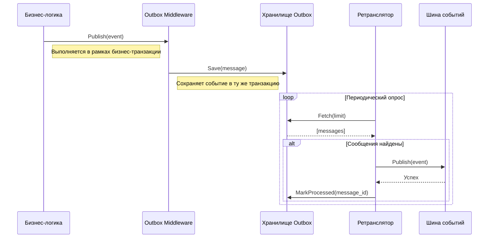

# Пакет `outbox`: Реализация паттерна Transactional Outbox

Пакет `outbox` предоставляет надежную реализацию паттерна "Transactional Outbox" для Go. Этот паттерн гарантирует, что события, возникающие в результате бизнес-транзакции, будут надежно доставлены, даже в случае сбоев. Основная идея заключается в том, чтобы сохранить событие в локальном хранилище (например, в той же базе данных, что и бизнес-сущности) в рамках одной транзакции, а затем асинхронно доставить его в шину сообщений.

## 🚀 Основные возможности

- **Гарантия "At-Least-Once Delivery":** Обеспечивает как минимум однократную доставку событий благодаря персистентному хранению и асинхронной ретрансляции.
- **Транзакционная целостность:** Сохранение события и изменение бизнес-сущности происходят в одной атомарной транзакции, что исключает потерю данных.
- **Абстракция от хранилища:** Пакет определяет интерфейс `Storage`, позволяя использовать любую реляционную или NoSQL базу данных в качестве хранилища для исходящих сообщений.
- **Гибкая конфигурация:** `Retransmitter` и `OutboxMiddleware` настраиваются с помощью паттерна "функциональные опции", что позволяет легко задавать интервал опроса, лимиты и другие параметры.
- **Прозрачная интеграция:** `OutboxMiddleware` легко встраивается в существующую `event.IBus`, перехватывая публикацию событий и направляя их в `Storage`.

## 🏛️ Архитектура и компоненты

Система состоит из следующих ключевых компонентов:

- **`Message`**: Структура, представляющая событие, сохраненное в хранилище. Содержит всю необходимую информацию для доставки: топик, тело сообщения, метаданные и статус.
- **`Storage[T]`**: Интерфейс, определяющий контракт для персистентного хранилища сообщений. Его реализация должна обеспечивать транзакционное сохранение и выборку сообщений.
- **`OutboxMiddleware[T]`**: Middleware для шины событий, которое перехватывает вызовы `Publish` и сохраняет события в `Storage` вместо прямой отправки в шину.
- **`Retransmitter[T]`**: Фоновый процесс (worker), который периодически опрашивает `Storage` на наличие необработанных сообщений, отправляет их в реальную шину событий и помечает как обработанные.
- **Опции (`With...`)**: Функции для гибкой конфигурации `OutboxMiddleware` и `Retransmitter`.

### Поток данных

Диаграмма ниже иллюстрирует полный жизненный цикл от создания события до его надежной доставки.



## 📖 Примеры использования

### 1. Определение хранилища

Сначала необходимо реализовать интерфейс `outbox.Storage`. Ниже приведен пример для PostgreSQL (см. `examples/outbox/postgres/postgres.go`).

```go
// Этот код является примером и требует наличия реальной реализации
// querier и работы с транзакциями из контекста.

type PostgresStorage[T event.Event] struct {
	db *sql.DB
}

func (s *PostgresStorage[T]) Save(ctx context.Context, msg *outbox.Message) error {
	// 1. Извлечь транзакцию из контекста
	tx, ok := ctx.Value("tx").(*sql.Tx)
	if !ok {
		return errors.New("транзакция не найдена в контексте")
	}

	// 2. Выполнить вставку в рамках транзакции
	q := querier.New(tx) // querier должен быть сгенерирован из SQL
	return q.CreateOutboxMessage(ctx, querier.CreateOutboxMessageParams{
		ID:        msg.ID,
		Topic:     msg.Topic,
		Payload:   msg.Payload,
		// ... остальные поля
	})
}

// ... реализации Fetch и MarkProcessed ...
```

### 2. Инициализация компонентов

```go
package main

import (
	"context"
	"database/sql"
	"log"
	"time"

	"github.com/x-research-team/dtx-framework/bus/event"
	"github.com/x-research-team/dtx-framework/bus/outbox"
	// ... импорт вашей реализации storage
)

// Определим простое событие
type UserCreatedEvent struct {
	ID    string
	Email string
	meta  map[string]string
}

func (e *UserCreatedEvent) Metadata() map[string]string { return e.meta }
func (e *UserCreatedEvent) Key() string                  { return e.ID }


func main() {
	// 1. Настройка зависимостей (БД, реальная шина событий)
	db, _ := sql.Open("postgres", "...")
	actualBus := event.NewBus[UserCreatedEvent](event.NewLocalProvider[UserCreatedEvent]())
	storage := NewPostgresStorage[UserCreatedEvent](db) // Ваша реализация

	// 2. Создание Outbox Middleware
	outboxMiddleware := outbox.NewOutboxMiddleware[UserCreatedEvent](
		storage,
		outbox.WithTopic[UserCreatedEvent]("user_events"),
	)

	// 3. Оборачивание реальной шины в middleware
	// Теперь все вызовы `Publish` будут идти в outbox.
	outboxBus := event.NewBus[UserCreatedEvent](outboxMiddleware.Wrap(actualBus.Provider()))

	// 4. Создание и запуск ретранслятора
	retransmitter := outbox.NewRetransmitter[UserCreatedEvent](
		storage,
		actualBus, // Ретранслятор использует реальную шину
		outbox.WithInterval[UserCreatedEvent](10*time.Second),
		outbox.WithLimit[UserCreatedEvent](50),
	)
	retransmitter.Start()
	defer retransmitter.Stop()

	// 5. Использование в бизнес-логике
	// Эта операция должна выполняться внутри транзакции,
	// где в контекст будет помещен объект транзакции.
	ctx := context.Background() // В реальности здесь должен быть контекст с транзакцией
	
	err := outboxBus.Publish(ctx, &UserCreatedEvent{
		ID:    "user-456",
		Email: "new.user@example.com",
		meta:  make(map[string]string),
	})
	if err != nil {
		log.Fatalf("Не удалось сохранить событие в outbox: %v", err)
	}

	log.Println("Событие UserCreatedEvent успешно сохранено в Outbox")
	// Ретранслятор доставит его позже.
}