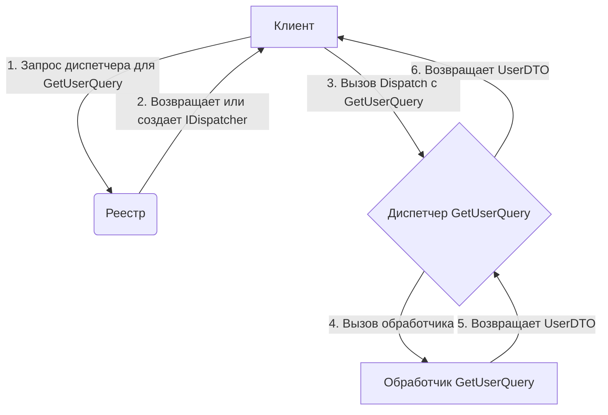

# Шина Запросов (`bus/query`)

Этот пакет предоставляет строго типизированную, синхронную шину запросов, реализующую паттерн "Посредник" (Mediator) для построения систем с низкой связностью и высокой степенью инкапсуляции логики получения данных.

## 🚀 Философия

Архитектура шины запросов, как и шины команд, основана на **специализации экземпляра через обобщенные типы (Generics)**. Этот подход обеспечивает **абсолютную типобезопасность на этапе компиляции**, полностью исключая ошибки несоответствия типов между запросом, его обработчиком и ожидаемым результатом.

- **Типобезопасность:** 100% ошибок, связанных с неверным запросом или неправильным типом результата, отлавливаются компилятором.
- **Производительность:** Отсутствие рефлексии в публичном API гарантирует минимальные накладные расходы при диспетчеризации.
- **Инкапсуляция:** Код, инициирующий запрос, ничего не знает о его исполнителе. Он зависит только от контракта запроса.

## 🎯 Ключевые Отличия от Шины Команд

| Критерий | Шина Запросов (`Query Bus`) | Шина Команд (`Command Bus`) |
| :--- | :--- | :--- |
| **Намерение** | Запрос на получение данных (Query). Не должен изменять состояние системы. | Запрос на выполнение действия (Command). Может изменять состояние. |
| **Адресат** | Один к одному. У запроса **ровно один** обработчик. | Один к одному. У команды **ровно один** обработчик. |
| **Связь** | Синхронная, двунаправленная. Отправитель **всегда** ожидает результат. | Синхронная, двунаправленная. Отправитель **всегда** ожидает результат. |
| **Результат** | Всегда возвращает результат (`R`) или ошибку (`error`). | Всегда возвращает результат (`R`) или ошибку (`error`). |

## 📈 Диаграмма Потока Выполнения



## 🛠️ Использование

### 1. Определение Запроса и его Результата

Запрос — это любая структура данных. Он параметризуется типом своего результата через интерфейс-маркер `Query[R]`.

```go
import "time"

// Определяем структуру для результата (DTO).
type UserDTO struct {
	ID        string
	Email     string
	CreatedAt time.Time
}

// Определяем запрос. Он не несет логики, только данные для поиска.
// ВАЖНО: Запрос должен быть параметризован своим типом результата.
type GetUserQuery struct {
	UserID string
}

// Чтобы связать запрос с результатом, достаточно реализовать интерфейс Query[R].
var _ Query[UserDTO] = (*GetUserQuery)(nil)
```

### 2. Получение Диспетчера из Реестра

Взаимодействие с шиной происходит через `Registry`, который управляет жизненным циклом диспетчеров.

```go
import "github.com/your-repo/dtx-framework/bus/query"

// 1. Создайте реестр. Обычно это делается один раз при старте приложения.
registry := query.NewRegistry()

// 2. Получите строго типизированный диспетчер для конкретного запроса и его результата.
// "users.get_by_id" - это уникальное имя для этой пары запрос-результат.
userDispatcher, err := query.Dispatcher[GetUserQuery, UserDTO](registry, "users.get_by_id")
if err != nil {
    // Обработка ошибки
}
```

### 3. Регистрация Обработчика

Обработчик — это функция, которая принимает запрос и возвращает результат (DTO) или ошибку.

```go
// Обработчик для GetUserQuery
func handleGetUser(ctx context.Context, qry GetUserQuery) (UserDTO, error) {
	fmt.Printf("Поиск пользователя с ID: %s\n", qry.UserID)
	
	// ... здесь ваша логика получения данных из БД ...
	
	if qry.UserID == "" {
		return UserDTO{}, errors.New("UserID не может быть пустым")
	}

	return UserDTO{
		ID:        qry.UserID,
		Email:     "user@example.com",
		CreatedAt: time.Now(),
	}, nil
}

// Регистрация обработчика в диспетчере.
err = userDispatcher.Register(handleGetUser)
if err != nil {
    // Обработка ошибки
}
```

### 4. Отправка Запроса и Получение Результата

Отправка запроса — это синхронный вызов, который блокируется до получения результата.

```go
// Создаем экземпляр запроса
qry := GetUserQuery{
	UserID: "user-123",
}

// Отправляем запрос и ждем результат
result, err := userDispatcher.Dispatch(context.Background(), qry)
if err != nil {
    // Обработка ошибки
}

fmt.Printf("Пользователь найден: Email=%s\n", result.Email)
```

### 5. Гарантии Типобезопасности

Любая попытка использовать диспетчер с неверными типами будет перехвачена компилятором.

```go
// ОШИБКА КОМПИЛЯЦИИ!
// Диспетчер ожидает GetUserQuery, а вы передаете другую структуру.
// _, err := userDispatcher.Dispatch(context.Background(), struct{}{})

// ОШИБКА КОМПИЛЯЦИИ!
// Диспетчер ожидает обработчик для GetUserQuery, а не для другой структуры.
// err := userDispatcher.Register(func(ctx context.Context, qry struct{}) (UserDTO, error) { ... })