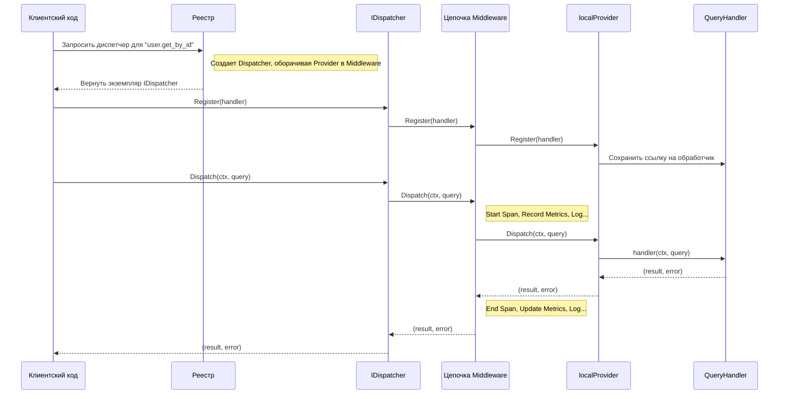

# Пакет `query`: Типобезопасная шина запросов

Пакет `query` предоставляет строго типизированную, расширяемую реализацию паттерна "Шина Запросов" (Query Bus) для Go, полностью интегрированную с OpenTelemetry для трассировки и сбора метрик. В отличие от шины команд, шина запросов предназначена для получения данных и не должна изменять состояние системы.

## 🚀 Основные возможности

- **Гарантия типобезопасности:** Использование дженериков `[Q Query[R], R any]` на всех уровнях (диспетчер, провайдер, обработчики) исключает ошибки несоответствия типов на этапе компиляции.
- **Централизованный реестр:** `Registry` действует как потокобезопасная фабрика и менеджер экземпляров диспетчеров, гарантируя уникальность диспетчера для каждого именованного типа запроса.
- **Принцип единственного обработчика:** Каждый запрос имеет ровно одного обработчика, который возвращает данные.
- **Расширяемость через провайдеры:** Архитектура построена на интерфейсе `Provider`, что позволяет легко заменять локальную реализацию на распределенные системы, не затрагивая бизнес-логику.
- **Встроенная наблюдаемость (Observability):** Мощная система `Middleware` позволяет добавлять сквозную функциональность. Пакет поставляется с готовыми middleware для:
    - **Структурированного логирования** с использованием `slog`.
    - **Сбора метрик** по стандарту OpenTelemetry (количество и длительность обработки запросов).
    - **Распределенной трассировки** по стандарту OpenTelemetry.
- **Гибкая конфигурация:** Применение паттерна "функциональные опции" позволяет детально настраивать диспетчер (логгер, трассировщик, кастомные middleware).

## 🏛️ Архитектура и компоненты

Система состоит из следующих ключевых компонентов:

- **`Query[R]`**: Интерфейс-маркер для любого запроса. `R` — это тип возвращаемого значения.
- **`QueryHandler[Q, R]`**: Строго типизированная функция, которая обрабатывает запрос `Q` и возвращает результат `R`.
- **`IDispatcher[Q, R]`**: Основной публичный интерфейс шины. Предоставляет методы `Dispatch`, `Register` и `Shutdown`.
- **`Registry`**: Потокобезопасный контейнер и фабрика для создания и получения экземпляров `IDispatcher`. Является основной точкой входа для работы с пакетом.
- **`NewDispatcher`**: Фабричная функция для прямого создания экземпляра диспетчера с необходимыми опциями.
- **`Provider[Q, R]`**: Внутренний интерфейс, абстрагирующий механизм выполнения запросов.
- **`localProvider[Q, R]`**: Реализация `Provider` по умолчанию, обеспечивающая внутрипроцессное выполнение.
- **`Middleware[Q, R]`**: Интерфейс для middleware, оборачивающего `Provider`.

### Поток данных

Диаграмма ниже иллюстрирует полный жизненный цикл отправки запроса и его обработки.



## 📖 Примеры использования

### 1. Определение запроса и DTO

Каждый запрос — это структура, которая служит для передачи данных. Для поддержки трассировки она также должна реализовывать `query.Metadatable`.

```go
package main

import "github.com/x-research-team/dtx-framework/bus/query"

// GetUserQuery - запрос на получение пользователя по ID.
// Возвращаемый тип - UserDTO.
type GetUserQuery struct {
	ID   string
	meta map[string]string
}

// UserDTO - структура для передачи данных пользователя.
type UserDTO struct {
    ID    string
    Email string
}

// NewGetUserQuery - конструктор для запроса.
func NewGetUserQuery(id string) GetUserQuery {
	return GetUserQuery{
		ID:   id,
		meta: make(map[string]string),
	}
}

// Metadata реализует интерфейс query.Metadatable.
func (q *GetUserQuery) Metadata() map[string]string {
	return q.meta
}
```

### 2. Создание обработчика

Обработчик - это функция, соответствующая сигнатуре `query.QueryHandler`.

```go
package main

import (
	"context"
	"fmt"
)

// handleGetUser обрабатывает запрос GetUserQuery.
func handleGetUser(ctx context.Context, q GetUserQuery) (UserDTO, error) {
	fmt.Printf("Обработка запроса: получение пользователя с ID: %s\n", q.ID)
	if q.ID == "" {
		return UserDTO{}, fmt.Errorf("ID не может быть пустым")
	}
	// ... логика получения пользователя из БД ...
	
	// Возвращаем DTO пользователя.
	return UserDTO{ID: q.ID, Email: "user@example.com"}, nil
}
```

### 3. Инициализация и использование

```go
package main

import (
	"context"
	"fmt"
	"log"

	"github.com/x-research-team/dtx-framework/bus/query"
)

func main() {
	// 1. Создаем новый реестр.
	registry := query.NewRegistry()

	// 2. Получаем строго типизированный диспетчер для нашего запроса.
	userDispatcher, err := query.Dispatcher[GetUserQuery, UserDTO](registry, "user.get")
	if err != nil {
		log.Fatalf("Не удалось получить диспетчер: %v", err)
	}

	// 3. Регистрируем обработчик.
	if err := userDispatcher.Register(handleGetUser); err != nil {
		log.Fatalf("Не удалось зарегистрировать обработчик: %v", err)
	}

	// 4. Создаем и отправляем запрос.
	q := NewGetUserQuery("user-123")
	user, err := userDispatcher.Dispatch(context.Background(), q)
	if err != nil {
		fmt.Printf("Ошибка выполнения запроса: %v\n", err)
	} else {
		fmt.Printf("Запрос успешно выполнен. Пользователь: %+v\n", user)
	}
}
```

### 4. Использование с полной наблюдаемостью

```go
package main

import (
	"log/slog"
	"os"

	"github.com/x-research-team/dtx-framework/bus/query"
	"go.opentelemetry.io/otel"
	"go.opentelemetry.io/otel/sdk/metric"
	"go.opentelemetry.io/otel/sdk/trace"
)

func setupDispatcherWithObservability(registry *query.Registry) (query.IDispatcher[GetUserQuery, UserDTO], error) {
	// --- Настройка компонентов наблюдаемости (пример) ---
	logger := slog.New(slog.NewJSONHandler(os.Stdout, nil))
	
	tracerProvider := trace.NewTracerProvider()
	otel.SetTracerProvider(tracerProvider)

	meterProvider := metric.NewMeterProvider()
	otel.SetMeterProvider(meterProvider)
	// ---

	// Конфигурируем диспетчер с помощью функциональных опций.
	return query.Dispatcher[GetUserQuery, UserDTO](
		registry,
		"user.get.observed",
		query.WithLogger[GetUserQuery, UserDTO](logger),
		query.WithTracerProvider[GetUserQuery, UserDTO](tracerProvider),
		query.WithMeterProvider[GetUserQuery, UserDTO](meterProvider),
	)
}